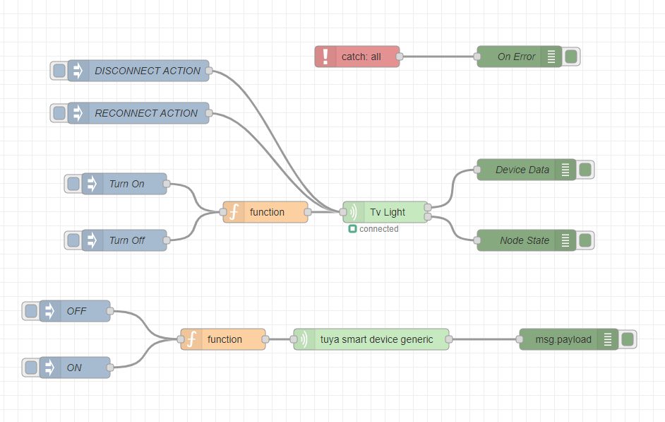
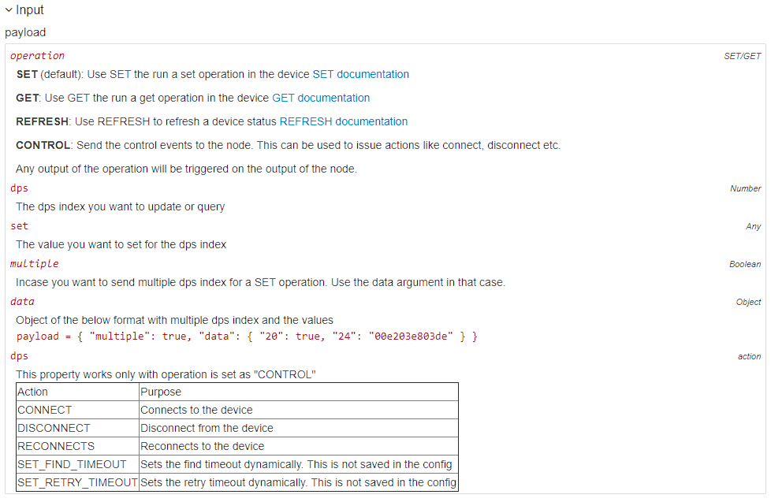
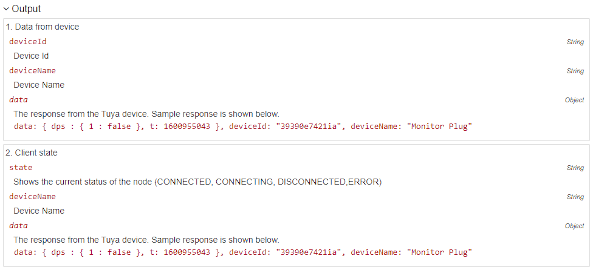

# node-red-contrib-tuya-smart-device

A node-red module which helps you to connect to any tuya device.

# Table of contents
- [Getting Started](#getting-started)
- [Setup](#setup)
    - [Input Format](#input-format)
    - [Output Format](#output-format)
- [License](#license)
- [Contributing](#contributing)

# Getting Started

Instructions for getting the device id is available [here](https://github.com/codetheweb/tuyapi/blob/master/docs/SETUP.md)

You will get the device id and the key once you run the wizard program as per the instructiions

        
# Setup

[(Back to top)](#table-of-contents)

The node takes one input and one output. Once you drop the node into the flow, you need to use the deviceid and devicekey that you got from the getting started step. 

Once you setup the node, you can then use input to send any command to the device as per the tuya standards.

# Input Format

[(Back to top)](#table-of-contents)

# Output Format

[(Back to top)](#table-of-contents)

# License

[(Back to top)](#table-of-contents)

MIT License - Copyright (c) 2020 Vinod S R

# Contributing

[(Back to top)](#table-of-contents)

Your contributions are always welcome! Please have a look at the [contribution guidelines](CONTRIBUTING.md) first. :tada:
